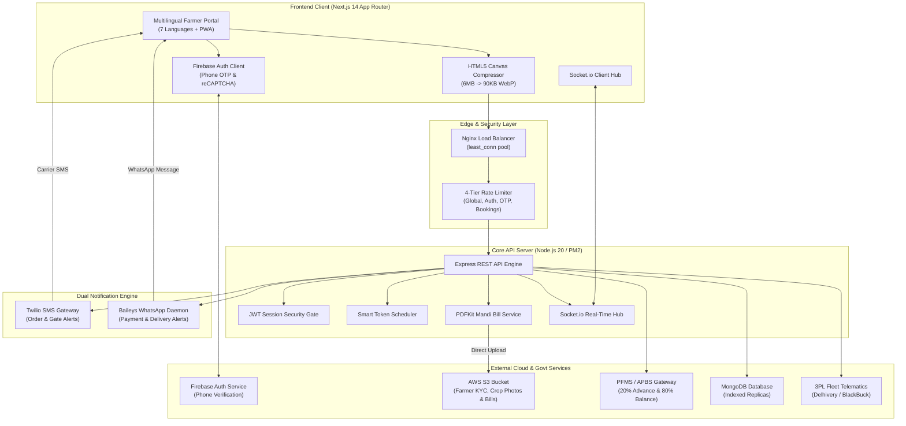

# SIH 2026 — Problem Statement PS26032

## National Farmer Procurement, Smart Queue & Logistics Tracking Platform
### राष्ट्रीय किसान खरीद, स्मार्ट कतार एवं लॉजिस्टिक्स ट्रैकिंग पोर्टल

> **Smart India Hackathon 2026** | **Category:** Software | **Theme:** Smart Automation  
> **Ministry:** Ministry of Consumer Affairs, Food & Public Distribution  
> **Department:** Department of Consumer Affairs (DoCA)  
> **Production Deployment:** [https://sih-32.vercel.app](https://sih-32.vercel.app)  
> **Architecture Specification:** See [structure.md](./structure.md) for full directory tree, schemas, and sequence diagrams.

---

## 🌾 The Problem & Context

> **Problem Statement (SIH26032):**  
> *"Farmers often face long waiting times, lack of information regarding procurement schedules, and uncertainty about procurement status at government procurement centres."*

During peak Rabi and Kharif harvesting seasons, millions of Indian farmers transport agricultural produce to APMC Mandis and state procurement centres. This causes:
1. **Severe Congestion & Highway Queue Spills:** Tractors and bullock carts waiting 18–48 hours outside mandi gates with zero schedule visibility.
2. **Distress Selling to Middlemen:** Uncertainty regarding daily Mandi intake quotas forces smallholder farmers to sell below the government Minimum Support Price (MSP).
3. **Cashflow Delays:** Farmers wait weeks for physical weighbridge slips and bank clearance before receiving financial compensation.
4. **Logistics Blindspots:** Lack of tracking between mandi weighbridge acceptance and buffer storage dispatch to Food Corporation of India (FCI) and Central Warehousing Corporation (CWC) godowns.

---

## 🏛️ The Solution

This platform is an official, production-grade digital government portal designed specifically for rural agricultural logistics. Built with the **Accessible & Ethical** archetype (UI/UX Pro Max), it provides:

* **Multilingual Accessibility (7 Languages):** Fully localized in English, हिंदी (Hindi), ਪੰਜਾਬੀ (Punjabi), বাংলা (Bengali), मराठी (Marathi), తెలుగు (Telugu), and தமிழ் (Tamil).
* **Nationwide Network of 18 Mandis across 13 States:** Full coverage with 7-day rolling slot availability and dynamic lane balancing.
* **Smart Token Scheduling & Live Search:** Algorithmic time-slot allotment preventing physical congestion, accompanied by a live search bar and state filter chips on the Live Queue board.
* **Farmer Identity & Crop Lot Verification:**
  * Front camera selfie capture for Mandi Gate Pass identity verification.
  * Rear camera grain lot sample photo upload for fast-track quality inspection.
  * In-browser HTML5 Canvas compression reducing 6MB mobile photos to ~90KB for 2G/3G rural networks.
* **20% Direct Benefit Transfer (DBT) Advance Guarantee:**
  * Immediate 20% advance credit directly to the farmer's Aadhaar-linked bank account upon slot confirmation and mandi arrival.
  * Transparent MSP value benchmark calculator for Wheat (₹2,275/q), Paddy (₹2,183/q), and Maize (₹2,090/q).
  * Final 80% balance auto-settlement on mandi weighbridge approval.
* **Dual-Channel Automated Farmer Notifications:**
  * **Twilio Carrier SMS:** Guaranteed transactional delivery for slot booking confirmations, gate entry alerts, and weighbridge lane calls.
  * **Automated WhatsApp Bot (Baileys):** Real-time WhatsApp alerts for 20% DBT advance credit, 80% balance settlement, and 3PL dispatch tracking.
* **Automated AWS S3 Mandi Bill Generation (PDFKit):**
  * Official Government of India procurement receipts streamed in PDF format with National Emblem watermark, QR token verification, weighbridge gross/tare breakdown, and PFMS payment UTRs.
  * Uploaded directly to AWS S3 bucket with instant download available to both farmers on the status tracker and staff in the Admin portal.
* **Admin Portal & Database Telemetry Console:**
  * Real-time Queue Operations & Token Caller.
  * **Registered Farmers & KYC Directory (`adminTab: 'users'`):** Filter by verification status, inspect Aadhaar & land record data, and view complete farmer dossiers.
  * **Database Inspector & Telemetry Module (`adminTab: 'database'`):** Live collection document counts, storage sizing, index health, and raw JSON document inspection.
* **Confidential 3rd-Party Logistics (3PL) Tracking:**
  * Authenticated end-to-end tracking of grain transport from Mandis to FCI/CWC godowns.
  * Real-time GPS container seals, vehicle registration, weighbridge slips, and driver contact verification with contracted 3PL partners (Delhivery, Rivigo, BlackBuck, TCI).

---

## 🏗️ System Architecture



---

## 🚀 Key Modules & Capabilities

### 1. Farmer Registration & Biometric KYC
* Dual authentication options: 1-click **Continue with Google** via Firebase Auth or Mobile OTP with automatic reCAPTCHA v3 bot deterrence.
* Seamless mobile linking for Google users ensuring 100% Mandi SMS Gate Pass and WhatsApp receipt delivery.
* Live front-camera selfie capture for Mandi Gate Pass identity cards.
* Client-side HTML5 canvas compression ensuring image payloads remain under 100KB on low-bandwidth rural networks.
* Accessible 4-step wizard with 48px+ touch targets optimized for mobile field conditions.

### 2. 18 Procurement Centres across 13 States & 7-Day Slots
* Complete pan-India network of active APMC Mandis:
  * *Delhi:* APMC Azadpur
  * *Punjab:* Grain Market Khanna
  * *Haryana:* Anaj Mandi Karnal
  * *Rajasthan:* APMC Kota
  * *Gujarat:* APMC Unjha, APMC Gondal
  * *Madhya Pradesh:* Krishi Upaj Mandi Indore, Krishi Upaj Mandi Ujjain
  * *Maharashtra:* APMC Vashi (Navi Mumbai), APMC Gultekdi (Pune)
  * *Telangana:* APMC Nizamabad, APMC Suryapet, APMC Warangal
  * *Karnataka:* APMC Yeshwanthpur (Bengaluru)
  * *Andhra Pradesh:* APMC Guntur
  * *Uttar Pradesh:* Mandi Samiti Bareilly, Mandi Samiti Aligarh
  * *Bihar:* Bhagwati Mandi Patna
* Rolling 7-day slot availability with hourly booking windows and capacity caps.

### 3. Crop Slot Booking & 20% DBT Advance Guarantee
* Visual selection cards for benchmark agricultural commodities:
  * **Wheat (गेहूं):** ₹2,275 / Quintal
  * **Paddy (धान):** ₹2,183 / Quintal
  * **Maize (मक्का):** ₹2,090 / Quintal
* Live financial breakdown:
  $$\text{Total Value} = \text{Quantity (Quintals)} \times \text{Government MSP}$$
  $$\mathbf{20\%\text{ Immediate Advance}} = \text{Credited to Bank Account via PFMS}$$
  $$\text{80\% Balance} = \text{Settled post-weighbridge certification}$$
* Crop sample photo capture attached to the digital Gate Pass.

### 4. Real-Time Mandi Queue & Search Board
* Live token status board powered by **WebSockets (Socket.io)**.
* **Search & Filter Bar:** Instant fuzzy search for procurement centres by name, code, state, or address with interactive search modal and state filter chips.
* Dynamic wait times, live weighbridge lane assignment (Lanes 1 to 4), and automated carrier SMS when the token is called.

### 5. Automated AWS S3 Mandi Bill Generation
* Generates official Government of India procurement receipts using `pdfkit`.
* Displays National Emblem header, QR code verification, farmer KYC, weighbridge tare/gross measurements, and PFMS transaction IDs.
* Automatically uploaded to **AWS S3** (`bills/BILL-<id>.pdf`) with local fallback.
* Available for one-click download by farmers on `/status` and mandi staff in the Admin console.

### 6. Dual-Channel Alerts: Twilio SMS + WhatsApp Daemon
* **Twilio Carrier SMS:** Slot confirmation SMS with center name, date, time window, and token code. Gate entry SMS when called to weighbridge.
* **Baileys WhatsApp Bot:** Rich WhatsApp messages sent directly to farmer's mobile number:
  * 20% Advance payment confirmation with PFMS UTR.
  * 80% Final balance payment confirmation with PDF Mandi Bill download link.
  * 3PL grain transit dispatch alert with truck plate, driver phone, and destination godown.
* Self-pairing endpoint at `/api/whatsapp/pair` for pairing with an 8-character code.

### 7. Administrative Control Center & Database Telemetry
* **Queue Operations:** Live token advancement (`Arrived` → `Weighed` → `Approved` → `Paid`), weighbridge lane assignment, and payment processing.
* **Registered Farmers & KYC Directory (`adminTab: 'users'`):** Search registered farmers, inspect verification status, verify bank details, and view photo dossiers.
* **Database Inspector & Telemetry Module (`adminTab: 'database'`):** Live health monitoring showing MongoDB collection document counts, collection storage size, index count, system uptime, and interactive raw document inspector with auto-refresh.

### 8. Confidential 3rd-Party Logistics (3PL) Tracking
* Full shipment lifecycle: `Produce Dispatched` → `Fleet Assigned` → `In Transit` → `Arrived at Buffer Godown` → `Delivered`.
* Protected by `requireFarmer` authentication: farmers view only their own consignments.
* Displays GPS container seal numbers, gross/tare weighbridge slips, and 3PL carrier details (Delhivery, Rivigo, BlackBuck).

---

## 🛠️ Tech Stack

| Layer | Technology | Purpose |
|---|---|---|
| **Frontend Framework** | Next.js 14 (App Router) + React 18 | High-performance server-rendered and static web pages |
| **Styling & Icons** | Tailwind CSS + Custom SVG Icons | Responsive, accessible government portal UI without AI emojis |
| **Internationalization** | Custom React i18n Context | Zero-dependency real-time localization across 7 Indian languages |
| **Backend Runtime** | Node.js 20 LTS + Express.js | Modular, high-throughput REST API |
| **Database** | MongoDB + Mongoose 8 | Document store for farmers, queues, slots, and consignments |
| **Process Manager** | PM2 | Production process management and zero-downtime clustering |
| **Object Storage** | AWS S3 SDK v3 (`@aws-sdk/client-s3`) | Cloud storage for identification, crop photos, and Mandi Bill PDFs |
| **PDF Generation** | PDFKit | Vector-quality official government Mandi Procurement Bills |
| **Carrier SMS** | Twilio REST API | Transactional SMS for slot confirmations and gate entry alerts |
| **Instant Messaging** | Baileys (`@whiskeysockets/baileys`) | WhatsApp Web socket daemon for rich payment & logistics alerts |
| **Real-time Engine** | Socket.io 4 | Instant queue token updates and lane call alerts |
| **Authentication** | JWT + Firebase Auth | Secure token-based session management and phone OTP verification |
| **Hosting & Proxy** | Vercel + Nginx + Ubuntu Linux | Edge frontend hosting and reverse proxy load balancing |

---

## 💻 Getting Started (Local Development)

### Prerequisites
* Node.js `>= 20.0.0`
* MongoDB running locally on `mongodb://127.0.0.1:27017` (or MongoDB Atlas URI)

### 1. Clone Repository
```bash
git clone https://github.com/subhobhai943/SIH2026-PS26032.git
cd SIH2026-PS26032
```

### 2. Backend Setup
```bash
cd server
cp .env.example .env  # Configure your MongoDB URI, Twilio keys, and optional AWS S3
npm install
npm run seed          # Seeds 18 procurement centres, demo staff, slots, and shipments
npm run dev           # Starts backend on http://localhost:5000
```

#### Demo Staff Credentials (Generated by seed):
* **Administrator:** `admin@sih26032.local` / `ChangeMe123!`
* **Mandi Operator:** `operator@sih26032.local` / `ChangeMe123!`

### 3. Frontend Setup
```bash
cd ../client
npm install
npm run dev           # Starts Next.js frontend on http://localhost:3000
```

---

## 🔐 Environment Configuration

### Backend (`server/.env`)
```env
# Server
PORT=5000
NODE_ENV=production
CLIENT_ORIGIN=https://sih-32.vercel.app,http://localhost:3000

# Database
MONGO_URI=mongodb://127.0.0.1:27017/sih26032

# Authentication
JWT_SECRET=your_super_secret_jwt_key
JWT_EXPIRES_IN=7d
OTP_TTL_MINUTES=5
OTP_DEV_MODE=false

# Twilio SMS Service
TWILIO_ACCOUNT_SID=your_twilio_account_sid
TWILIO_AUTH_TOKEN=your_twilio_auth_token
TWILIO_PHONE_NUMBER=your_twilio_phone_number

# AWS S3 Cloud Storage
AWS_S3_BUCKET=your_s3_bucket_name
AWS_REGION=your_aws_region
AWS_ACCESS_KEY_ID=your_access_key
AWS_SECRET_ACCESS_KEY=your_secret_key
```

### Frontend (`client/.env.local`)
```env
NEXT_PUBLIC_API_URL=https://sih-32.vercel.app/api
NEXT_PUBLIC_FIREBASE_API_KEY=your_firebase_key
NEXT_PUBLIC_FIREBASE_PROJECT_ID=your_project_id
```

---

## 📡 Core API Reference

| Domain | Method | Route | Access | Description |
|---|---|---|---|---|
| **Auth** | `POST` | `/api/farmers/otp/request` | Public | Send mobile login OTP (tight rate limit) |
| **Auth** | `POST` | `/api/farmers/otp/verify` | Public | Verify OTP and issue farmer JWT |
| **Auth** | `POST` | `/api/farmers/firebase/verify` | Public | Verify Firebase phone ID token |
| **Auth** | `POST` | `/api/farmers/google/verify` | Public | Verify Firebase Google ID token & link profile |
| **Profile** | `GET` | `/api/farmers/me` | Farmer | Retrieve authenticated farmer dossier |
| **Profile** | `PUT` | `/api/farmers/me` | Farmer | Update farmer profile & KYC details |
| **Media** | `POST` | `/api/upload` | Farmer | Upload selfie or crop photo to AWS S3 |
| **Media** | `GET` | `/api/media/*` | Public | Secure media proxy with HTTP cache headers |
| **Centres** | `GET` | `/api/centers` | Public | List 18 active procurement mandis |
| **Slots** | `GET` | `/api/slots` | Public | Browse 7-day rolling slot availability |
| **Booking** | `POST` | `/api/slots/book` | Farmer | Book slot, attach crop photo & issue token |
| **Booking** | `GET` | `/api/slots/bookings/me` | Farmer | List all active bookings for authenticated farmer |
| **Queue** | `GET` | `/api/queue/:centerId` | Public | Real-time live token queue board |
| **Queue** | `GET` | `/api/queue/me/position` | Farmer | Live wait time & position in line |
| **Logistics** | `GET` | `/api/shipments/my-shipments`| Farmer | Confidential grain transport consignments |
| **Logistics** | `GET` | `/api/shipments/track/:query`| Farmer | Track shipment by Gate Pass or LR number |
| **Admin Auth** | `POST` | `/api/admin/login` | Staff | Mandi officer authentication |
| **Admin Queue**| `GET` | `/api/admin/queue` | Staff | Complete operational queue board |
| **Admin Queue**| `POST` | `/api/admin/queue/:id/check-in`| Staff | Mark farmer checked-in at gate |
| **Admin Queue**| `POST` | `/api/admin/queue/:id/call-next`| Staff | Advance queue & dispatch Twilio SMS |
| **Admin Stage**| `PATCH`| `/api/admin/procurement/:id`| Staff | Progress stage: Arrived → Weighed → Paid |
| **Admin Pay** | `POST` | `/api/admin/procurement/:id/pay-advance` | Staff | Record 20% DBT Advance & send WhatsApp |
| **Admin Pay** | `POST` | `/api/admin/procurement/:id/pay-balance` | Staff | Record 80% Balance & send WhatsApp |
| **Admin Bill**| `POST` | `/api/admin/procurement/:id/generate-bill`| Staff | Generate PDFKit Mandi Bill & upload to S3 |
| **Admin Users**| `GET` | `/api/admin/farmers` | Staff | List registered farmers & KYC verification status |
| **Admin Users**| `GET` | `/api/admin/farmers/:id` | Staff | View full farmer profile & KYC dossier |
| **Admin Telemetry**| `GET` | `/api/admin/database/overview` | Staff | Live collection stats, sizes, index counts |
| **Admin Telemetry**| `GET` | `/api/admin/database/collection/:name` | Staff | Query documents with pagination |
| **WhatsApp** | `GET` | `/api/whatsapp/pair` | Staff | Pair WhatsApp Web daemon via 8-digit code |

---

## 👥 Smart India Hackathon 2026 Team

* **Problem Statement:** PS26032
* **Project Name:** National Farmer Procurement, Smart Queue & Logistics Tracking Platform
* **Ministry:** Ministry of Consumer Affairs, Food & Public Distribution
* **Department:** Department of Consumer Affairs (DoCA)

---

## 📄 License

Copyright (c) 2026 subhobhai943. All Rights Reserved.  
This project is licensed under a **Proprietary & Confidential Private License**. Unauthorized copying, reproduction, distribution, modification, or commercial exploitation is strictly prohibited. See [LICENSE](./LICENSE) for full legal terms.

