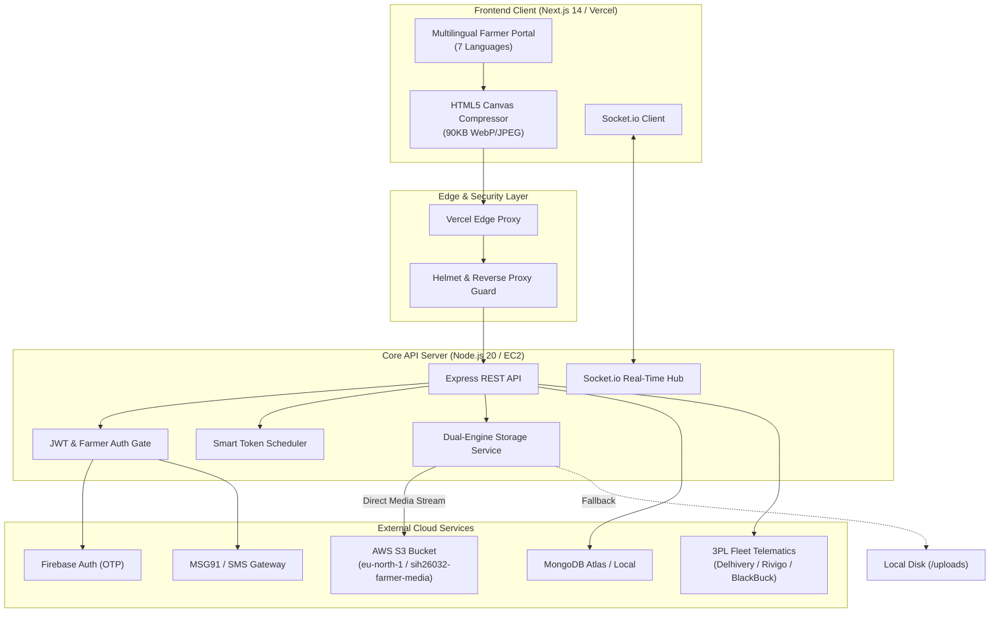

# SIH 2026 — Problem Statement PS26032

## National Farmer Procurement, Smart Queue & Logistics Tracking Platform
### राष्ट्रीय किसान खरीद, स्मार्ट कतार एवं लॉजिस्टिक्स ट्रैकिंग पोर्टल

> **Smart India Hackathon 2026** | **Category:** Software | **Theme:** Smart Automation  
> **Ministry:** Ministry of Consumer Affairs, Food & Public Distribution  
> **Department:** Department of Consumer Affairs (DoCA)  
> **Production Deployment:** [https://sih-32.vercel.app](https://sih-32.vercel.app)

---

## 🌾 The Problem & Context

> **Problem Statement (SIH26032):**  
> *"Farmers often face long waiting times, lack of information regarding procurement schedules, and uncertainty about procurement status at government procurement centres."*

During peak Rabi and Kharif harvesting seasons, millions of Indian farmers transport grain to agricultural procurement centres (Mandis / APMCs). This leads to:
1. **Severe Congestion & Highway Queue Spills:** Tractors and bullock carts waiting 18–48 hours outside mandi gates with zero schedule visibility.
2. **Distress Selling to Middlemen:** Uncertainty regarding daily Mandi intake limits forces smallholder farmers to sell below the government Minimum Support Price (MSP).
3. **Cashflow Delays:** Farmers wait weeks for physical weighbridge slips and bank clearance before receiving any financial compensation.
4. **Logistics Blindspots:** Lack of tracking between mandi weighbridge acceptance and buffer storage dispatch to Food Corporation of India (FCI) and Central Warehousing Corporation (CWC) godowns.

---

## 🏛️ The Solution

This platform is an official, production-grade digital government portal designed specifically for rural agricultural logistics. Built with the **Accessible & Ethical** archetype (UI/UX Pro Max), it provides:

* **Multilingual Accessibility (7 Languages):** Fully localized in English, हिंदी (Hindi), ਪੰਜਾਬੀ (Punjabi), বাংলা (Bengali), मराठी (Marathi), తెలుగు (Telugu), and தமிழ் (Tamil).
* **Smart Token Scheduling:** Algorithmic time-slot allotment preventing physical congestion at procurement centres.
* **Farmer Identity & Crop Lot Verification:**
  * Front camera selfie capture for Mandi Gate Pass identity verification.
  * Rear camera grain lot sample photo upload for fast-track quality inspection.
  * In-browser image compression reducing 6MB mobile photos to ~90KB for 2G/3G rural networks.
* **20% Direct Benefit Transfer (DBT) Advance Guarantee:**
  * Immediate 20% advance credit directly to the farmer's Aadhaar-linked bank account upon slot confirmation.
  * Transparent MSP value benchmark calculator for Wheat, Paddy, and Maize.
  * Final 80% balance auto-settlement on mandi weighbridge approval.
* **Confidential 3rd-Party Logistics Order Tracking:**
  * Authenticated end-to-end tracking of grain transport from Mandis to FCI/CWC godowns.
  * Real-time GPS container seals, vehicle registration, and driver contact verification with contracted 3PL partners (Delhivery, Rivigo, BlackBuck, TCI).
* **High-Durability Cloud Architecture:** Powered by AWS S3 object storage with automated local storage failover and Socket.io real-time queue boards.

---

## 🏗️ System Architecture



---

## 🚀 Key Features

### 1. Farmer Registration & Identity Verification
* Mobile OTP verification via **Firebase Auth** with automatic SMS gateway integration.
* Camera capture for farmer identification photograph.
* Accessible 4-step stepper with 48px+ touch targets optimized for mobile browsers in field conditions.

### 2. Crop Slot Booking & MSP Advance Calculator
* Visual selection cards for benchmark agricultural commodities:
  * **Wheat (गेहूं):** ₹2,275 / Quintal
  * **Paddy (धान):** ₹2,183 / Quintal
  * **Maize (मक्का):** ₹2,090 / Quintal
* Live financial breakdown:
  $$\text{Total Expected Value} = \text{Quantity} \times \text{Government MSP}$$
  $$\mathbf{20\%\text{ Safety Advance}} = \text{Credited to DBT Bank Account}$$
  $$\text{80\% Balance} = \text{Settled post-weighbridge certification}$$
* Crop sample lot photograph attached to the digital Gate Pass.

### 3. Real-Time Mandi Queue Management
* Live token status board powered by **WebSockets (Socket.io)**.
* Dynamic estimated wait times, live lane assignment, and automated SMS alerts when the farmer's token is called.
* Admin panel for procurement officers to manage: `Arrived` → `Weighed` → `Approved` → `Paid`.

### 4. 3rd-Party Logistics (3PL) & Godown Tracking
* Full shipment lifecycle: `Produce Dispatched` → `Fleet Assigned` → `In Transit` → `Arrived at Buffer Godown` → `Delivered`.
* Security Gate: Protected by `requireFarmer` authentication. Farmers can only view their own confidential consignments.
* Digital Mandi Gate Pass verification, gross/tare weighbridge slips, GPS container seal IDs, and driver identity cards.

### 5. Dual-Mode Storage (AWS S3 + Local Fallback)
* **Production:** Direct upload to **AWS S3** (`sih26032-farmer-media`).
* **Development / Offline:** Automated zero-configuration fallback to local static file storage in `server/uploads/`.
* **Client-Side Compression:** Images compressed to < 100KB before upload, cutting 95% bandwidth on rural 3G/4G networks.

---

## 🛠️ Tech Stack

| Layer | Technology | Purpose |
|---|---|---|
| **Frontend Framework** | Next.js 14 (App Router) + React 18 | High-performance server-rendered and static web pages |
| **Styling & Icons** | Tailwind CSS + Lucide SVG Icons | Responsive, accessible government portal UI without AI emojis |
| **Internationalization** | Custom React i18n Context | Zero-dependency real-time localization across 7 Indian languages |
| **Backend Runtime** | Node.js 20 LTS + Express.js | Robust, modular micro-service API |
| **Database** | MongoDB + Mongoose 8 | Document store for farmers, queues, slots, and consignments |
| **Object Storage** | AWS S3 SDK v3 (`@aws-sdk/client-s3`) | High-durability cloud storage for identification and crop media |
| **Real-time Engine** | Socket.io 4 | Instant queue token updates and dispatch alerts |
| **Authentication** | JWT (JSON Web Tokens) + Firebase Auth | Secure token-based session management and phone OTP verification |
| **Process Manager** | PM2 | Production process management and zero-downtime reloads |
| **CI/CD & Hosting** | GitHub Actions + Vercel + AWS EC2 | Automated multi-stage build verification and cloud deployment |

---

## 💻 Getting Started (Local Development)

### Prerequisites
* Node.js `>= 20.0.0`
* MongoDB instance running locally on `mongodb://127.0.0.1:27017` (or MongoDB Atlas URI)

### 1. Clone Repository
```bash
git clone https://github.com/subhobhai943/SIH2026-PS26032.git
cd SIH2026-PS26032
```

### 2. Backend Setup
```bash
cd server
cp .env.example .env  # Configure your MongoDB URI and optional AWS S3 keys
npm install
npm run seed          # Seeds demo procurement centres, staff logins, and slots
npm run dev           # Starts backend on http://localhost:5000
```

#### Demo Staff Credentials (Generated by seed):
* **Administrator:** `admin@sih26032.local` / `ChangeMe123!`
* **Mandi Operator:** `operator@sih26032.local` / `ChangeMe123!`

### 3. Frontend Setup
```bash
cd ../client
npm install
npm run dev           # Starts Next.js frontend on http://localhost:3000
```

---

## 🔐 Environment Configuration

### Backend (`server/.env`)
```env
# Server
PORT=5000
NODE_ENV=production
CLIENT_ORIGIN=https://sih-32.vercel.app,http://localhost:3000

# Database
MONGO_URI=mongodb://127.0.0.1:27017/sih26032

# Authentication
JWT_SECRET=your_super_secret_jwt_key
JWT_EXPIRES_IN=7d
OTP_TTL_MINUTES=5
OTP_DEV_MODE=false

# SMS Gateways
SMS_PROVIDER=console # 'console' or 'msg91'
MSG91_AUTH_KEY=your_msg91_key

# AWS S3 Cloud Storage
AWS_S3_BUCKET=sih26032-farmer-media
AWS_REGION=eu-north-1
AWS_ACCESS_KEY_ID=your_access_key
AWS_SECRET_ACCESS_KEY=your_secret_key
```

### Frontend (`client/.env.local`)
```env
NEXT_PUBLIC_API_URL=https://sih-32.vercel.app/api
NEXT_PUBLIC_FIREBASE_API_KEY=your_firebase_key
NEXT_PUBLIC_FIREBASE_PROJECT_ID=your_project_id
```

---

## 📡 Core API Reference

| Domain | Method | Route | Access | Description |
|---|---|---|---|---|
| **Auth** | `POST` | `/api/farmers/otp/request` | Public | Send mobile login OTP |
| **Auth** | `POST` | `/api/farmers/otp/verify` | Public | Verify OTP and issue farmer JWT |
| **Auth** | `POST` | `/api/farmers/firebase/verify` | Public | Verify Firebase phone ID token |
| **Profile** | `GET` | `/api/farmers/me` | Farmer | Retrieve authenticated farmer dossier |
| **Profile** | `PUT` | `/api/farmers/me` | Farmer | Update farmer profile & selfie photo |
| **Media** | `POST` | `/api/upload` | Farmer | Upload farmer/crop photo to AWS S3 |
| **Centres** | `GET` | `/api/centers` | Public | List active procurement mandis |
| **Slots** | `GET` | `/api/slots` | Public | Browse availability for a mandi and date |
| **Booking** | `POST` | `/api/slots/book` | Farmer | Book slot, attach crop photo & token |
| **Queue** | `GET` | `/api/queue/:centerId` | Public | Real-time queue board |
| **Queue** | `GET` | `/api/queue/me/position` | Farmer | Live wait time & position in line |
| **Logistics** | `GET` | `/api/shipments/my-shipments`| Farmer | Confidential grain transport dossiers |
| **Logistics** | `GET` | `/api/shipments/track/:query`| Farmer | Track shipment by Gate Pass or LR number |
| **Admin** | `POST` | `/api/admin/login` | Staff | Mandi officer authentication |
| **Admin** | `POST` | `/api/admin/queue/:id/call-next`| Staff | Advance queue & dispatch farmer SMS |
| **Admin** | `PATCH`| `/api/admin/procurement/:id`| Staff | Move stage: Arrived → Weighed → Paid |

---

## 👥 Smart India Hackathon Team

* **Problem Statement:** PS26032
* **Project Name:** Smart Farmer Procurement & Logistics Platform
* **Ministry:** Ministry of Consumer Affairs, Food & Public Distribution

---

## 📄 License
This project is open-source under the [MIT License](./LICENSE).
