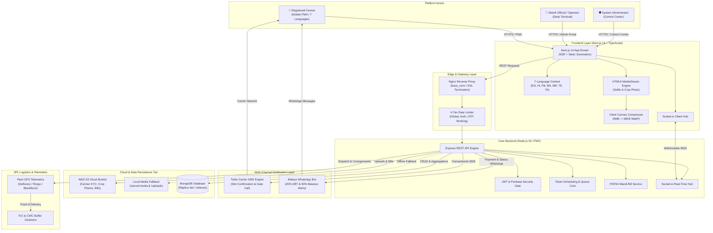
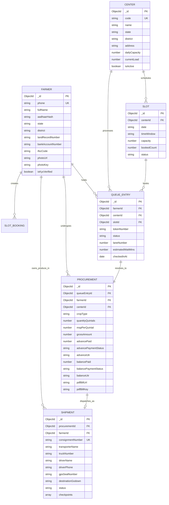
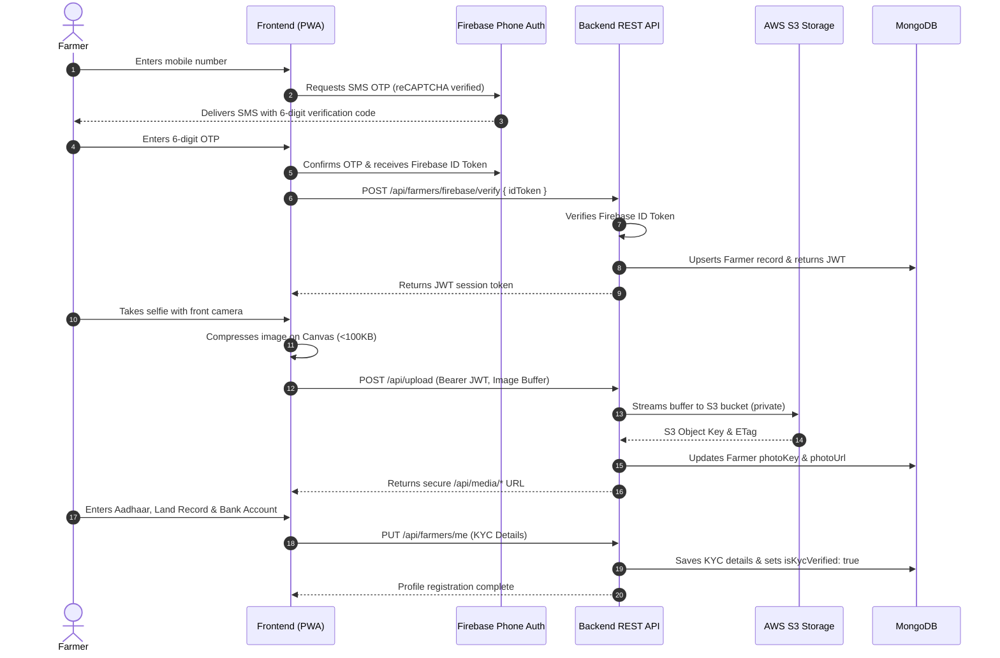
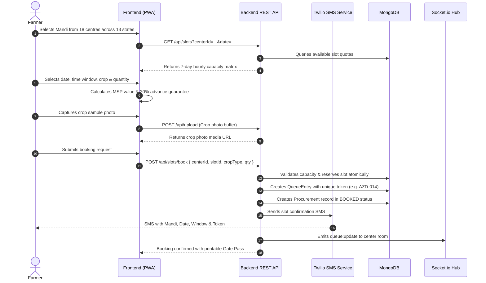
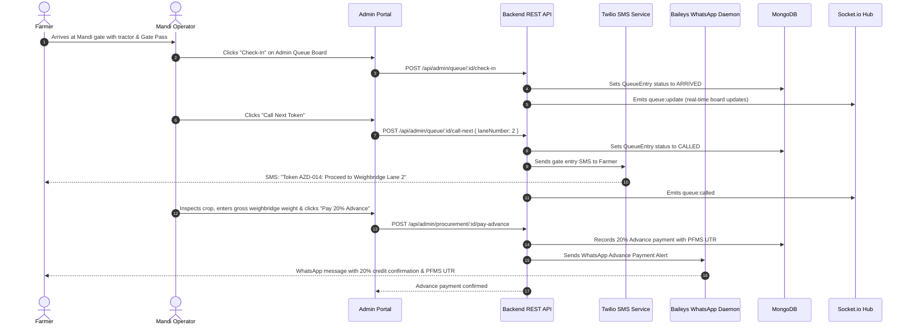
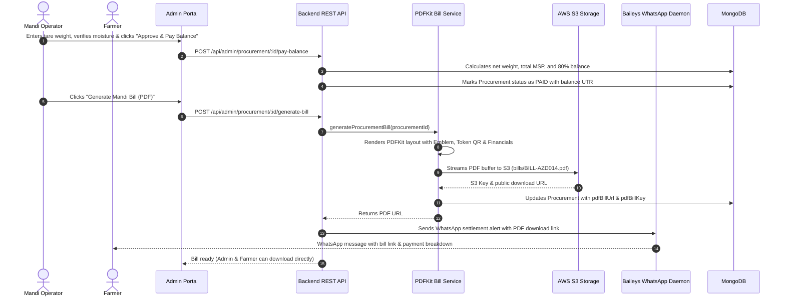

# Architecture & Codebase Structure Specification

## National Farmer Procurement, Smart Queue & Logistics Tracking Platform
### Smart India Hackathon 2026 — Problem Statement PS26032
**Ministry of Consumer Affairs, Food & Public Distribution | Department of Consumer Affairs (DoCA)**  
**Production Portal:** [https://sih-32.vercel.app](https://sih-32.vercel.app)

---

## 1. Executive Summary & Architectural Overview

The **National Farmer Procurement, Smart Queue & Logistics Tracking Platform** is an enterprise-grade digital public infrastructure designed to modernize agricultural commodity intake at government procurement centres (APMCs/Mandis). It addresses severe mandi gate congestion, lack of scheduling visibility, distress sales below Minimum Support Price (MSP), payment settlement delays, and downstream 3PL logistics blindspots.

The platform is engineered as a decoupled, multi-tier cloud-native system:
- **Client Tier:** Next.js 14 App Router application with React 18, Tailwind CSS, GSAP animations, native HTML5 camera capture, client-side Canvas compression, zero-dependency 7-language internationalization, and WebSockets.
- **Edge & API Gateway Tier:** Nginx reverse proxy with `least_conn` load balancing, multi-tiered Express rate limiting, and CORS security headers.
- **Application & Service Tier:** Node.js 20 LTS runtime orchestrated via PM2 process management, modular Express.js controllers, JWT authentication, and event-driven Socket.io hub.
- **Messaging & Multichannel Notification Tier:** Dual-channel communications incorporating Twilio transactional SMS for carrier-grade delivery and Baileys WhatsApp Daemon for instant rich notifications.
- **Document Generation & Storage Tier:** Automated PDFKit government mandi bill generator paired with an AWS S3 object storage engine and transparent local disk fallback.
- **Persistence Tier:** MongoDB document database with compound indexes for high-throughput slot booking and real-time queue states.



---

## 2. Complete Repository Directory Hierarchy

Below is the exhaustive, production-verified directory tree of the repository:

```
SIH2026-PS26032/
├── LICENSE                                # Proprietary & Confidential License
├── README.md                              # Main Project Overview & Quickstart Guide
├── structure.md                           # This Architecture & Codebase Specification
│
├── client/                                # Frontend Application (Next.js 14 App Router)
│   ├── next.config.mjs                    # Next.js compiler & domain image configuration
│   ├── package.json                       # Client dependencies (React 18, GSAP, Tailwind)
│   ├── postcss.config.mjs                 # PostCSS plugin configuration
│   ├── tailwind.config.ts                 # Design system theme, colors, typography
│   ├── tsconfig.json                      # Strict TypeScript compiler options
│   │
│   ├── public/                            # Static Public Assets
│   │   ├── manifest.json                  # PWA Web Application Manifest
│   │   ├── og-image.jpg                   # Open Graph social preview card
│   │   └── og-image.png                   # High-res social banner
│   │
│   └── src/                               # Application Source Code
│       ├── app/                           # Next.js App Router Pages & Layouts
│       │   ├── layout.tsx                 # Root HTML shell, fonts, client providers
│       │   ├── page.tsx                   # Landing Page (Hero, Stats, Testimonials, CTA)
│       │   ├── error.tsx                  # Global error boundary component
│       │   ├── global-error.tsx           # Fallback error template for root layout
│       │   ├── icon.svg                   # Dynamic SVG Favicon (Wheat emblem)
│       │   ├── apple-icon.svg             # Apple Touch Icon
│       │   ├── opengraph-image.jpg        # Edge-rendered OpenGraph metadata image
│       │   ├── twitter-image.jpg          # Edge-rendered Twitter Card metadata image
│       │   │
│       │   ├── register/                  # Farmer Onboarding & Biometric Registration
│       │   │   └── page.tsx               # 4-step KYC, Phone OTP, Camera Selfie capture
│       │   │
│       │   ├── booking/                   # Procurement Slot Booking & MSP Calculator
│       │   │   └── page.tsx               # 18 Mandis, 7-day slots, 20% advance calculator
│       │   │
│       │   ├── queue/                     # Live Mandi Token Queue & Search
│       │   │   └── page.tsx               # Real-time token board, center search bar & modal
│       │   │
│       │   ├── status/                    # Farmer Procurement Tracker & Bill Downloader
│       │   │   └── page.tsx               # 5-stage progress, S3 Mandi Bill PDF download
│       │   │
│       │   ├── tracking/                  # 3PL Grain Transit Logistics Tracking
│       │   │   └── page.tsx               # GPS container seal, truck/driver dossier, route
│       │   │
│       │   ├── reviews/                   # Buyer Ratings & Verified Farmer Directory
│       │   │   └── page.tsx               # Public feedback, crop lot showcase, ratings
│       │   │
│       │   └── admin/                     # Comprehensive Mandi Staff & Admin Portal
│       │       └── page.tsx               # Queue Ops, Farmers KYC Directory, DB Telemetry
│       │
│       ├── components/                    # Reusable React UI Components
│       │   ├── ui.tsx                     # Accessible UI kit (Buttons, Badges, Cards, Modals)
│       │   ├── icons.tsx                  # Custom SVG icon set (No third-party emoji bloat)
│       │   ├── SiteHeader.tsx             # Responsive header, mobile navigation drawer
│       │   ├── SiteFooter.tsx             # Official Government of India & DoCA footer
│       │   ├── LanguageModal.tsx          # 7-Language selection modal with native scripts
│       │   └── ClientProviders.tsx        # Combined Language & Theme provider wrapper
│       │
│       ├── lib/                           # Frontend Core Utilities & Contexts
│       │   ├── api.ts                     # Fetch wrapper with JWT injection & error handling
│       │   ├── firebase.ts                # Firebase Phone Auth & reCAPTCHA configuration
│       │   ├── socket.ts                  # Socket.io client connector with auto-reconnect
│       │   ├── imageUtils.ts              # Client-side HTML5 Canvas image compressor (<100KB)
│       │   ├── animations.ts              # GSAP tween and stagger animation helpers
│       │   │
│       │   ├── i18n/                      # Internationalization Engine
│       │   │   ├── LanguageContext.tsx    # React Context for active language state
│       │   │   ├── languages.ts           # Language codes, names, native labels, flags
│       │   │   └── translations.ts        # Comprehensive 7-language translation dictionary
│       │   │
│       │   └── theme/                     # Theme Management
│       │       └── ThemeContext.tsx       # System / Dark / Light theme provider
│       │
│       └── styles/                        # Global Style Definitions
│           └── globals.css                # Tailwind directives, CSS variables, keyframes
│
└── server/                                # Backend Application (Node.js 20 + Express)
    ├── package.json                       # Server dependencies (Express, Mongoose, Twilio)
    ├── ecosystem.config.cjs               # PM2 Process Manager cluster configuration
    ├── nginx-load-balancer.conf           # Production Nginx reverse proxy configuration
    │
    ├── media/                             # Local Media Repository (Fallback Storage)
    │   ├── backgrounds/                   # Web-optimized background landscapes
    │   ├── crops/                         # Commodity reference images (Wheat, Paddy, Maize)
    │   └── farmers/                       # Demo verified farmer portrait avatars
    │
    ├── uploads/                           # Local disk upload destination (when S3 is offline)
    │
    └── src/                               # Backend Source Code
        ├── index.js                       # HTTP server entry point & Socket.io initialization
        ├── app.js                         # Express app setup, middleware chaining, routing
        │
        ├── config/                        # System Configurations
        │   ├── db.js                      # MongoDB connection pool & reconnection hooks
        │   ├── env.js                     # Zod-validated environment variable schema
        │   └── firebase.js                # Firebase Admin SDK initialization
        │
        ├── models/                        # Mongoose Data Models & Schemas
        │   ├── Farmer.js                  # Farmer profile, KYC details, bank account, selfie
        │   ├── Center.js                  # Procurement centre, location, capacity, status
        │   ├── Slot.js                    # Daily slot schedule, hourly windows, availability
        │   ├── Queue.js                   # Live queue token, stages, lane, wait times
        │   ├── Procurement.js             # Weighbridge record, 20% advance, 80% balance, PDF
        │   ├── Shipment.js                # 3PL logistics dossier, truck, GPS seals, transit
        │   ├── Review.js                  # Farmer and procurement center reviews & ratings
        │   ├── Staff.js                   # Admin and operator credentials, bcrypt hashes
        │   ├── Notification.js            # In-app push notifications & alerts
        │   └── Otp.js                     # Temporary SMS OTP verification records
        │
        ├── controllers/                   # REST API Business Logic Handlers
        │   ├── adminController.js         # Queue ops, stage updates, payments, KYC & DB tele
        │   ├── farmerController.js        # OTP request/verify, profile dossier, notifications
        │   ├── slotController.js          # Centers listing, 7-day availability, slot booking
        │   ├── queueController.js         # Public queue board, farmer position, status
        │   ├── shipmentController.js      # Confidential logistics tracking & checkpoints
        │   ├── reviewController.js        # Review submissions, helpful marks, farmer listing
        │   ├── uploadController.js        # Photo processing & S3 object streaming
        │   └── mediaController.js         # Secure media proxy with HTTP cache headers
        │
        ├── routes/                        # Express Route Declarations
        │   ├── adminRoutes.js             # /api/admin endpoints (Staff RBAC protected)
        │   ├── farmerRoutes.js            # /api/farmers endpoints (Farmer JWT protected)
        │   ├── slotRoutes.js              # /api/slots & /api/centers endpoints
        │   ├── queueRoutes.js             # /api/queue endpoints
        │   ├── shipmentRoutes.js          # /api/shipments endpoints
        │   ├── reviewRoutes.js            # /api/reviews endpoints
        │   ├── uploadRoutes.js            # /api/upload endpoint
        │   ├── mediaRoutes.js             # /api/media/* secure proxy endpoint
        │   └── whatsappRoutes.js          # /api/whatsapp/pair & QR pairing endpoints
        │
        ├── services/                      # Decoupled Infrastructure Services
        │   ├── pdfBillService.js          # PDFKit Mandi Bill generation & AWS S3 upload
        │   ├── smsService.js              # Twilio transactional SMS delivery engine
        │   ├── whatsappService.js         # Baileys WhatsApp Daemon for payment/delivery alerts
        │   ├── queueService.js            # Token numbering, lane assignment, wait estimator
        │   └── socketService.js           # Socket.io room broadcaster for real-time events
        │
        ├── middleware/                    # HTTP Interceptors & Security Filters
        │   ├── auth.js                    # JWT verification (requireFarmer, requireStaff)
        │   ├── rateLimiter.js             # Express rate limiters for DoS prevention
        │   └── errorHandler.js            # Centralized exception formatter & masking
        │
        └── utils/                         # Helper Scripts, Seeders & Utilities
            ├── ApiError.js                # Custom operational error subclass
            ├── datetime.js                # Indian Standard Time (IST) formatting helpers
            ├── sanitize.js                # PII masking (Aadhaar, Phone, Bank Account)
            ├── validate.js                # Request body validation helpers
            ├── seed.js                    # Comprehensive database seeder (18 Mandis, slots)
            ├── seedShipments.js           # Realistic 3PL logistics consignments seeder
            ├── seedReviews.js             # Community buyer reviews seeder
            ├── seedAdminSub.js            # Admin credentials initial seeder
            └── uploadMediaToS3.js         # Batch migration script for local media to S3
```

---

## 3. Frontend Architecture (`client/`)

### 3.1 Design System & Accessibility Paradigm
The frontend adheres to the **Accessible & Ethical** archetype (UI/UX Pro Max):
- **Contrast & Legibility:** Designed for harsh outdoor daylight conditions on low-cost Android smartphones.
- **Minimum Target Dimensions:** 48px+ interactive tap targets for buttons, selectors, and tabs.
- **High-Performance Native SVGs:** Complete absence of external emoji fonts or third-party bloated icon libraries, utilizing hand-crafted accessible SVGs in [`src/components/icons.tsx`](file:///home/ubuntu/SIH2026-PS26032/client/src/components/icons.tsx).
- **Reduced Data Footprint:** Client-side HTML5 Canvas compression ensures image uploads stay under 100KB, critical for 2G/3G rural cellular connections.

### 3.2 Routing & Page Modules

| Route | Page File | Primary Purpose & Key Capabilities |
|---|---|---|
| `/` | [`src/app/page.tsx`](file:///home/ubuntu/SIH2026-PS26032/client/src/app/page.tsx) | **Landing & Gateway:** Multilingual hero banner, real-time platform metrics counter, 3-step farmer journey explainer, live queue teaser card, farmer testimonials, and official DoCA links. |
| `/register` | [`src/app/register/page.tsx`](file:///home/ubuntu/SIH2026-PS26032/client/src/app/register/page.tsx) | **Farmer KYC Onboarding:** Dual-authentication onboarding: (1) 1-click **Continue with Google** via Firebase Auth or Mobile OTP verification with reCAPTCHA v3 bot deterrence, (2) Seamless mobile linking for Google accounts to receive Mandi SMS gate passes, (3) Mandatory biometric photo capture with client-side canvas compression, (4) Farmer profile & address dossier. |
| `/booking` | [`src/app/booking/page.tsx`](file:///home/ubuntu/SIH2026-PS26032/client/src/app/booking/page.tsx) | **Slot Scheduling & MSP Calculator:** Discovery of 18 nationwide procurement centres across 13 states with state filter pills. Live rolling 7-day slot availability calendar. Real-time MSP value calculator (Wheat ₹2,275, Paddy ₹2,183, Maize ₹2,090) showing the 20% advance payout. Crop lot sample camera photo upload. |
| `/queue` | [`src/app/queue/page.tsx`](file:///home/ubuntu/SIH2026-PS26032/client/src/app/queue/page.tsx) | **Live Token Queue Board:** Real-time Socket.io token board. Mandi search bar with interactive search modal supporting fuzzy search by center name, code, state, or address. State filter chips. Shows current called token, assigned lane, and estimated wait times. |
| `/status` | [`src/app/status/page.tsx`](file:///home/ubuntu/SIH2026-PS26032/client/src/app/status/page.tsx) | **Procurement Tracker & Bill Download:** 5-stage visual progress tracker (`BOOKED` → `ARRIVED` → `WEIGHED` → `APPROVED` → `PAID`). Shows 20% DBT Advance payment status with PFMS reference and 80% balance settlement. One-click button to download the official AWS S3 Mandi Bill PDF. Printable gate pass slip. |
| `/tracking` | [`src/app/tracking/page.tsx`](file:///home/ubuntu/SIH2026-PS26032/client/src/app/tracking/page.tsx) | **3PL Logistics Tracking:** Authenticated tracking of post-procurement grain transport to FCI/CWC buffer godowns. Displays transport partner (Delhivery, Rivigo, BlackBuck), driver name & phone, truck plate number, GPS container seal IDs, weighbridge slips, and route checkpoints. |
| `/reviews` | [`src/app/reviews/page.tsx`](file:///home/ubuntu/SIH2026-PS26032/client/src/app/reviews/page.tsx) | **Public Ratings & Farmer Showcase:** Community feedback on mandi efficiency, verified farmer profiles, crop lot gallery, and rating submission form. |
| `/admin` | [`src/app/admin/page.tsx`](file:///home/ubuntu/SIH2026-PS26032/client/src/app/admin/page.tsx) | **Administrative Control Center:** Staff dashboard containing 6 dedicated operational modules: (1) Queue Operations & Token Caller, (2) Registered Farmers KYC Directory (`adminTab: 'users'`), (3) Database Inspector & Telemetry (`adminTab: 'database'`), (4) Mandi Centres Manager, (5) Load Balancer & Rate Limits, (6) Buyer Reviews Moderation. |

### 3.3 State Management & Client Libraries
- **Language Context ([`src/lib/i18n/LanguageContext.tsx`](file:///home/ubuntu/SIH2026-PS26032/client/src/lib/i18n/LanguageContext.tsx)):** Provides dynamic language state persisted to `localStorage`. Supports 7 Indian languages with fallback to English.
- **WebSocket Connector ([`src/lib/socket.ts`](file:///home/ubuntu/SIH2026-PS26032/client/src/lib/socket.ts)):** Manages singleton Socket.io client connection with automatic reconnection, heartbeat, and room subscription lifecycle (`joinCenter(centerId)`).
- **Client Image Compression ([`src/lib/imageUtils.ts`](file:///home/ubuntu/SIH2026-PS26032/client/src/lib/imageUtils.ts)):** Renders uploaded or camera-captured files to an HTML5 offscreen canvas, downscaling high-resolution images to a maximum width of 1280px at 0.8 quality WebP/JPEG, compressing 6MB mobile photos to ~90KB.
- **Centralized API Wrapper ([`src/lib/api.ts`](file:///home/ubuntu/SIH2026-PS26032/client/src/lib/api.ts)):** Handles HTTP requests, bearer token injection from storage, and error parsing.

---

## 4. Backend Architecture (`server/`)

### 4.1 Server Startup & Middleware Pipeline
1. **Entry Point ([`src/index.js`](file:///home/ubuntu/SIH2026-PS26032/server/src/index.js)):**
   - Connects to MongoDB via Mongoose connection pool.
   - Creates HTTP server and initializes the Socket.io server with strict CORS policies matching client origins.
   - Listens on port 5000 (managed via PM2 cluster).
   - Listens for `SIGINT` and `SIGTERM` signals for graceful socket disconnection and database closing.
2. **App Configuration ([`src/app.js`](file:///home/ubuntu/SIH2026-PS26032/server/src/app.js)):**
   - **Security Headers:** `helmet` for defense against clickjacking, sniffing, and XSS.
   - **CORS:** Restricts cross-origin requests to configured domains (`https://sih-32.vercel.app`, `http://localhost:3000`).
   - **Rate Limiting:** Protects endpoints against denial of service and brute-force abuse:
     - `globalLimiter`: 300 requests per 15-minute window per IP.
     - `authLimiter`: 10 requests per 15-minute window for staff login.
     - `otpLimiter`: 5 requests per 10-minute window for mobile OTP endpoints to prevent SMS bombing.
     - `bookingLimiter`: 15 bookings per hour per IP.
   - **Static & Media Routing:** Proxies media through `/api/media/*` and serves uploads.
   - **Centralized Error Handler:** Intercepts unhandled errors, formats operational `ApiError` instances, and suppresses internal stack traces in production.

### 4.2 Data Models & Database Schema Design



### 4.3 Core Backend Services

#### 1. PDF Mandi Bill Generation Service ([`src/services/pdfBillService.js`](file:///home/ubuntu/SIH2026-PS26032/server/src/services/pdfBillService.js))
- Uses `PDFKit` to dynamically stream official Government of India procurement bills in memory.
- Contains DoCA headers, National Emblem watermark, barcode/QR code representation of the token, farmer details, crop quality inspection results, tare/gross weighbridge measurements, and financial settlement breakdown (20% advance + 80% balance).
- Uploads the generated PDF buffer to AWS S3 under key `bills/BILL-<procurementId>.pdf` with `application/pdf` MIME type.
- Employs automatic local file fallback (`server/media/bills/`) if S3 is unavailable.
- Updates the `Procurement` document with the public download link (`pdfBillUrl`) and S3 key (`pdfBillKey`).

#### 2. SMS Notification Service ([`src/services/smsService.js`](file:///home/ubuntu/SIH2026-PS26032/server/src/services/smsService.js))
- Integrates with **Twilio REST API** (`twilio(accountSid, authToken)`) using verified sender numbers.
- Automated SMS templates:
  - `sendOtpSms`: Delivers 6-digit login verification codes.
  - `sendSlotBookingSms`: Sends instant confirmation with Mandi name, date, time window, and allotted token number.
  - `sendQueueCalledSms`: Dispatches high-priority gate entry notification with lane assignment when token is called.
  - `sendProcurementStageSms`: Notifies farmer as produce advances from weighbridge to final approval.

#### 3. WhatsApp Daemon Service ([`src/services/whatsappService.js`](file:///home/ubuntu/SIH2026-PS26032/server/src/services/whatsappService.js))
- Employs **Baileys** (`@whiskeysockets/baileys`) to maintain an active WhatsApp Web multi-device connection without relying on expensive per-message third-party gateways.
- Provides `/api/whatsapp/pair` web endpoint allowing mandi operators to pair with an 8-character code directly from their browser.
- Automatically sends rich WhatsApp message alerts:
  - **20% Advance Payment Alert:** Sends immediate notification when advance DBT is disbursed, containing PFMS UTR, amount in Rupees, and bank account suffix.
  - **80% Final Balance Settlement Alert:** Sends complete financial settlement summary along with a direct link to download the S3 Mandi Bill PDF.
  - **3PL Logistics Dispatch Alert:** Sends vehicle number, driver contact, GPS container seal, and destination FCI/CWC godown address when grain is dispatched from the Mandi.

#### 4. Real-Time Socket Service ([`src/services/socketService.js`](file:///home/ubuntu/SIH2026-PS26032/server/src/services/socketService.js))
- Manages Socket.io server instance with room isolation.
- Clients subscribe to specific mandi rooms: `socket.join('center:' + centerId)`.
- Events emitted:
  - `queue:update`: Broadcasts updated token list and lane allocations.
  - `queue:called`: Broadcasts when a specific token is called to a lane.
  - `stats:update`: Broadcasts real-time center throughput and remaining capacity.

#### 5. Queue Engine Service ([`src/services/queueService.js`](file:///home/ubuntu/SIH2026-PS26032/server/src/services/queueService.js))
- Computes deterministic token codes based on center acronym and sequential counter (e.g., `AZD-001`).
- Dynamically assigns weighbridge lanes (Lanes 1 to 4) based on load balancing algorithms.
- Computes estimated waiting times based on rolling 5-transaction average weighbridge processing durations.

---

## 5. End-to-End Workflows & Dataflow Sequences

### Flow A: Farmer Registration & KYC Verification


### Flow B: Procurement Slot Booking & Token Issuance


### Flow C: Mandi Arrival, Weighbridge & 20% Advance DBT


### Flow D: Final Settlement & AWS S3 PDF Mandi Bill Generation


---

## 6. Security, Authentication & Rate Limiting

### 6.1 Authentication Mechanics
- **Farmer Authentication:**
  - Dual options on `/register`: 1-click **Continue with Google** (`signInWithPopup(auth, GoogleAuthProvider)`) and Mobile OTP verification with reCAPTCHA v3 bot deterrence.
  - Server-side Firebase ID token verification using Firebase Admin SDK (`verifyFirebaseToken` and `verifyFirebaseGoogleToken`).
  - Automatic account linking across Google UID, email, and phone number with sparse MongoDB indexing.
  - Issues signed JWT tokens (`HS256`, 7-day lifespan) containing the farmer's MongoDB `_id` and verified phone number.
  - All protected farmer routes are shielded by the [`requireFarmer`](file:///home/ubuntu/SIH2026-PS26032/server/src/middleware/auth.js) middleware.
- **Staff & Admin Authentication:**
  - Staff credentials stored with salted **bcrypt** password hashes.
  - Role-Based Access Control (`requireStaff('admin')` vs `requireStaff('operator')`).
  - Sensitive administrative operations (center creation, database telemetry inspection) require the `admin` role.

### 6.2 Data Privacy & PII Protection
- **Aadhaar Protection:** Government Aadhaar numbers are never stored in raw plaintext; they are sanitized and hashed using one-way SHA-256 digests in [`src/utils/sanitize.js`](file:///home/ubuntu/SIH2026-PS26032/server/src/utils/sanitize.js).
- **Masked Data Display:** Bank account numbers and phone numbers are masked in API responses (`•••• •••• 4092`).
- **Private S3 Storage & Secure Media Proxy:** AWS S3 credentials and raw bucket URLs are kept private in backend environment variables. Images and bills are securely served via `/api/media/*` proxy routes with HTTP cache headers (`Cache-Control: public, max-age=31536000, immutable`) and ETag validation.

### 6.3 Multi-Tier Rate Limiting Architecture
Configured via `express-rate-limit` in [`src/middleware/rateLimiter.js`](file:///home/ubuntu/SIH2026-PS26032/server/src/middleware/rateLimiter.js):

| Limiter | Scope | Window | Max Hits | Rationale |
|---|---|---|---|---|
| `globalLimiter` | All `/api/*` routes | 15 Minutes | 300 | Mitigates overall HTTP floods & DoS attempts |
| `authLimiter` | `/api/admin/login` | 15 Minutes | 10 | Defends against administrative brute-force attacks |
| `otpLimiter` | `/api/farmers/otp/*` | 10 Minutes | 5 | Prevents SMS spamming, OTP enumeration & cost spikes |
| `bookingLimiter` | `/api/slots/book` | 1 Hour | 15 | Stops automated scalper scripts from hoarding slots |

---

## 7. Production Deployment & Telemetry Topology

The platform operates on a production-ready stack:

- **Frontend:** Deployed on **Vercel** (`https://sih-32.vercel.app`) with edge caching and static optimization.
- **Backend Service:** Deployed on **Ubuntu Linux Server** managed by **PM2** process supervisor:
  - PM2 App Name: `sih-backend`
  - Mode: `fork` (scalable to `cluster` across CPU cores via `ecosystem.config.cjs`)
  - Auto-restart on memory threshold exceedance (`max_memory_restart: '500M'`)
  - Exponential backoff restart delay to prevent crash loops
- **Reverse Proxy:** **Nginx** configuration ([`server/nginx-load-balancer.conf`](file:///home/ubuntu/SIH2026-PS26032/server/nginx-load-balancer.conf)) with `least_conn` upstream balancing, HTTP/1.1 WebSocket upgrading (`Upgrade $http_upgrade`), and gzip compression.
- **Database:** **MongoDB** with automated index creation on boot.
- **Admin Telemetry & DB Inspector:** Built-in real-time telemetry panel in the Admin dashboard showing live memory footprint, event loop lag, collection document counts, and raw database inspection without third-party tools.

---
*Maintained by the SIH 2026 PS26032 Development Team.*
